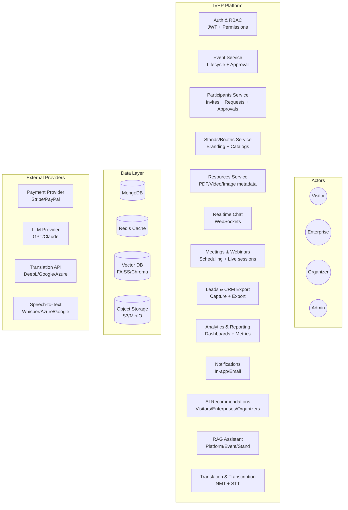
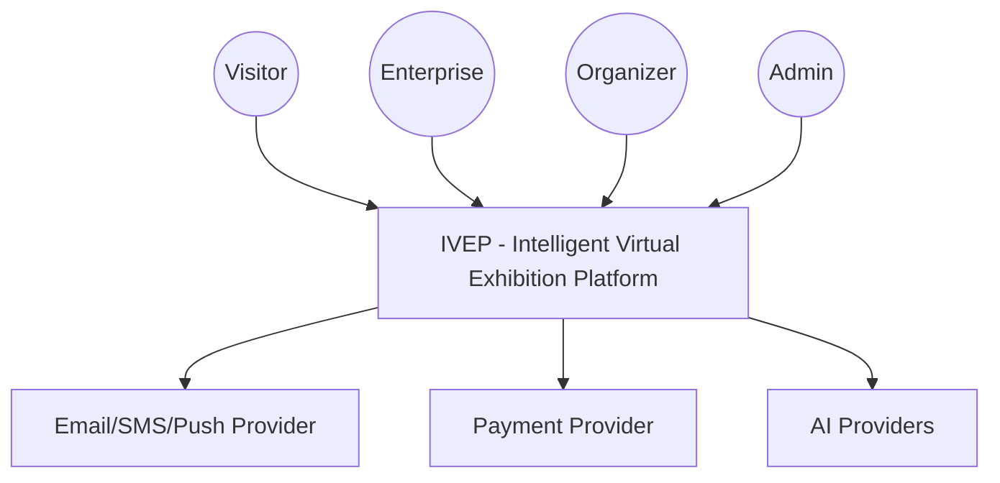
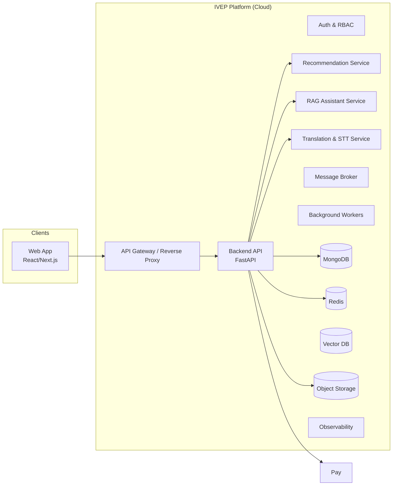
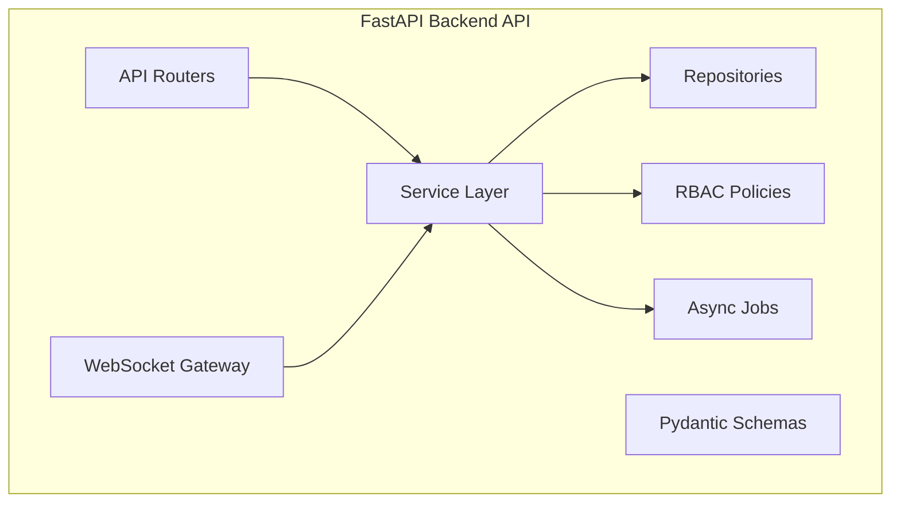
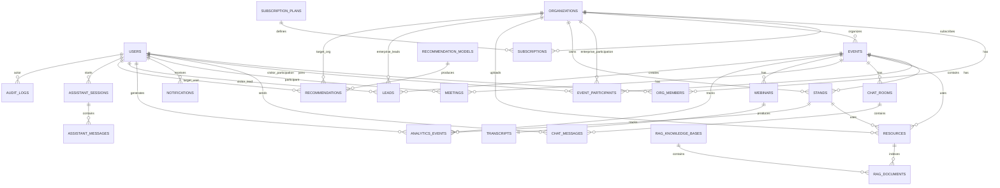

Absolutely, abdelilah — I can assemble a **complete, clean, production‑ready `README.md`** that summarizes everything from our entire conversation, the PRD, the vision document, the architecture diagrams, the ERD, the journeys, and the unified mega‑journey.

Below is a **single Markdown file** you can paste directly into your GitHub repository  
👉 **`Intelligent-Virtual-Exhibition-Platform/README.md`**

It is structured like a professional PFE / engineering project README.

---

# **Intelligent Virtual Exhibition Platform (IVEP)**  
### **Full Technical & Functional Documentation**  
### *(Generated from the complete project conversation)*

---

## **1. Project Overview**
The **Intelligent Virtual Exhibition Platform (IVEP)** is a scalable, AI‑powered SaaS platform that enables organizers, enterprises, and visitors to participate in immersive online exhibitions.

It replicates and enhances physical expos through:

- 2D/3D virtual halls  
- Real‑time chat, meetings, and webinars  
- AI‑powered recommendations & matchmaking  
- RAG-based multilingual assistants  
- Analytics & lead generation  
- Subscription-based monetization  

This repository contains the full backend, frontend, and AI architecture required to run the platform.

---

## **2. Core Vision**
IVEP aims to become a **regional and international digital business ecosystem**, enabling:

- Global accessibility  
- Intelligent networking  
- Measurable ROI for exhibitors  
- Automated assistance  
- Scalable event hosting  

---

## **3. Actors & Roles**
| Actor | Capabilities |
|-------|--------------|
| **Admin** | Approves events, manages users/orgs, subscriptions, analytics |
| **Organizer** | Creates events, invites participants, assigns stands, manages layout |
| **Enterprise** | Manages stand, catalogs, resources, interacts with visitors, captures leads |
| **Visitor** | Joins events, visits stands, interacts, receives recommendations |

---

## **4. Unified Journey Map (All Actors)**  
*(Mermaid diagram)*



---

## **5. System Architecture (C4 Model)**

### **5.1 Level 1 — System Context**


### **5.2 Level 2 — Container Diagram**


### **5.3 Level 3 — Backend Component Diagram**


---

## **6. MongoDB ERD (Full Diagram)**



---

## **7. Backend Architecture (FastAPI)**

### **Folder Structure**
```
backend/
  app/
    main.py
    core/
      config.py
      security.py
      dependencies.py
      logging.py
      rate_limit.py
    db/
      mongo.py
      indexes.py
    common/
      enums.py
      errors.py
      pagination.py
      utils.py
    modules/
      auth/
      users/
      organizations/
      subscriptions/
      events/
      participants/
      stands/
      resources/
      chat/
      meetings/
      webinars/
      transcripts/
      analytics/
      leads/
      notifications/
      ai_recommendations/
      ai_rag/
      ai_translation/
    workers/
      worker.py
      tasks/
    tests/
    scripts/
    docker/
```

---

## **8. Frontend Architecture (Next.js)**

### **Page Map**
#### **Public**
- `/`
- `/events`
- `/events/:id`
- `/login`
- `/register`

#### **Visitor**
- `/v/dashboard`
- `/v/events`
- `/v/events/:id/live`
- `/v/stands/:id`
- `/v/chat`
- `/v/assistant`

#### **Enterprise**
- `/e/dashboard`
- `/e/resources`
- `/e/events/:id/stand`
- `/e/leads`
- `/e/network`
- `/e/chat`
- `/e/assistant`

#### **Organizer**
- `/o/dashboard`
- `/o/events/new`
- `/o/events/:id/manage`
- `/o/events/:id/stands`
- `/o/events/:id/analytics`

#### **Admin**
- `/admin/dashboard`
- `/admin/events`
- `/admin/users`
- `/admin/orgs`
- `/admin/subscriptions`
- `/admin/analytics`
- `/admin/audit-logs`

---

## **9. AI Layer**
### **Recommendation Engine**
- Hybrid model:
  - Collaborative filtering (SVD)
  - Content-based (TF‑IDF)
  - Clustering for B2B matchmaking

### **RAG Assistant**
- Embeddings → Vector DB → LLM generation  
- Multilingual  
- Event-level, stand-level, platform-level knowledge

### **Translation & STT**
- Real-time translation  
- Speech-to-text for webinars  

---

## **10. Scalability & Security**
- Async FastAPI  
- Horizontal scaling  
- Redis caching  
- JWT authentication  
- RBAC  
- GDPR compliance  

---

## **11. Development Roadmap**
### **Phase 1 — MVP**
- Auth  
- 2D stands  
- Chat  
- Lead capture  
- Admin dashboard  

### **Phase 2 — Intelligence**
- Webinars  
- Analytics  
- Recommendations  
- RAG assistant  

### **Phase 3 — Premium**
- 3D halls  
- Advanced matchmaking  
- CRM integrations  

---

## **12. Repository Link**
This documentation corresponds to your project:  
👉 **https://github.com/AbdelilahElgallati/Intelligent-Virtual-Exhibition-Platform**

---